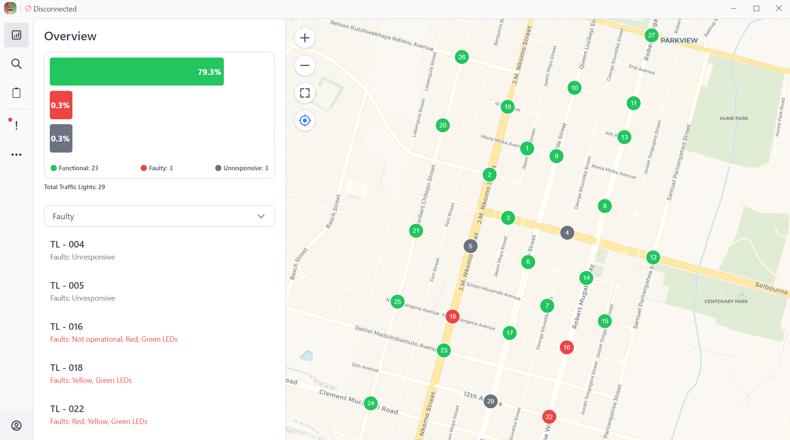

# Traffic Lights Management System

This repository contains the **Traffic Lights Management System**, a desktop application designed to monitor and manage traffic light operations for efficient traffic flow and improved safety.

> **Developed as part of an electronics engineering final project**

The system supports both **simulation-based operation** (for development and demonstration) and **real hardware integration** using a distributed ESP32 mesh network.



---

## Features

- **Real-Time Traffic Light Monitoring**
  - Live updates of traffic light states
  - Bitmask-based status representation

- **Simulation Mode (Default)**
  - Generates realistic traffic light behavior
  - Used for development, testing, and demonstrations
  - No hardware required

- **Hardware Mode (Optional)**
  - Receives real-time updates from ESP32 devices
  - Designed for offline, local-network operation
  - No internet connection required

- **Scalable Design**
  - Supports multiple intersections and traffic lights

- **Desktop Application**
  - Runs as a standalone Electron app
  - Cross-platform support (Windows, Linux)

---

## Technologies Used

### Desktop Application
- **Electron** – Desktop application framework
- **Vue.js** – Frontend UI
- **Node.js** – Application backend and IPC handling

### Hardware & Networking
- **ESP32**
- **ESP-NOW Mesh Networking**
- **WebSocket (local network only)**

---

## Architecture Overview

```
Simulation Mode:
┌──────────────────┐
│ Simulation Logic │
└─────────┬────────┘
          ▼
┌──────────────────┐
│ Electron + Vue UI│
└──────────────────┘

Hardware Mode:
┌──────────────────┐
│ ESP32 Nodes      │
│ (ESP-NOW Mesh)   │
└─────────┬────────┘
          ▼
┌──────────────────┐
│ ESP32 MASTER     │
│(WebSocket Server)│
└─────────┬────────┘
          ▼
┌──────────────────┐
│ Electron + Vue UI│
└──────────────────┘
```

- ESP-NOW is used for **local, low-latency mesh communication**
- WebSocket is used for **real-time monitoring**
- The system works **fully offline** on a local Wi-Fi or hotspot network

---

## Installation

### Prerequisites

Ensure you have the following installed:
- **Node.js** (LTS recommended)
- **npm**
- A supported OS (Windows / Linux)

---

### Steps

1. **Clone the repository**
   ```bash
   git clone https://github.com/mntando/Traffic-lights-management-system.git
   cd Traffic-lights-management-system
   ```

2. **Install dependencies**

   ```bash
   npm install
   ```

3. **Run the application**

   ```bash
   npm run dev
   ```

---

## Usage

### Simulation Mode (Default)

* Launch the application
* Traffic lights update automatically using simulated data
* No configuration or hardware required

### Hardware Mode (Optional)

* Requires an ESP32-based traffic light system
* The desktop app listens for real-time updates over WebSocket
* ESP32 devices and the PC must be on the **same local network**
  (e.g. PC hotspot or router)

Hardware mode is disabled by default and can be enabled in the application logic.

---

## Hardware Integration

This repository **does not contain hardware code**.

The system is designed to work with a **distributed ESP32 mesh network** implemented using ESP-NOW, where:

* Multiple ESP32 nodes control traffic lights
* A MASTER ESP32 aggregates mesh data
* The MASTER ESP32 exposes a **local WebSocket server**
* The desktop application connects to it over the local network

### Reference Implementation

All hardware-related logic is implemented in a separate repository:

🔗 **ENowMesh – ESP32 Mesh Networking**
[https://github.com/mntando/ENowMesh](https://github.com/mntando/ENowMesh)

Please refer to that repository for:

* ESP32 firmware
* ESP-NOW mesh configuration
* Message formats
* Hardware setup details

---

## Contribution

Contributions are welcome.

1. Fork the repository
2. Create a new branch

   ```bash
   git checkout -b feature-name
   ```
3. Commit your changes

   ```bash
   git commit -m "Add feature-name"
   ```
4. Push the branch

   ```bash
   git push origin feature-name
   ```
5. Open a Pull Request

---

## License

This project is licensed under the **MIT License**.

---

## Author

* **Author:** MV
* **GitHub:** [https://github.com/mntando](https://github.com/mntando)
